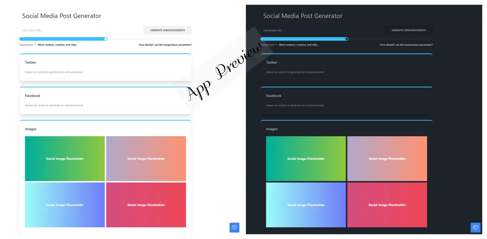

# Social Media Post Generator

Social Media Post Generator is a cutting-edge application built with the power of Nuxt3 and the OpenAI chatGPT API. This application takes any article link and generates engaging social media posts for Twitter and Facebook, effectively encapsulating the essence of the article for your audience. It also creates an image relevant to the article's context and title, enhancing the visual appeal of your social media posts.

Additionally, we have implemented a customer support bot to assist you and generate what you need within the app's context.

## Technologies Used

* Nuxt3
* Tailwind CSS
* OpenAI chatGPT API
* Cypress (for end-to-end testing)

## Application Preview

[App Preview Video](https://github.com/FADL285/social-media-post-generator/assets/53804570/0c9deeb3-a168-4e2e-8f66-1da7f1d5db1c)



## Google Chrome Extension

A Chrome extension for this application is also available for use. It can be found in the 'extension' folder of this project.

Chrome Extension Preview:

[Extension Preview Video](https://github.com/FADL285/social-media-post-generator/assets/53804570/a1e870f8-5db0-43ff-9bcf-8cc6f0e80ec3)

## Setup and Installation

To get the application up and running, you'll need an API key from OpenAI. Get it [here](https://platform.openai.com/account/api-keys).

### Step-by-step guide

1. Clone the repository to your local machine using `git clone`.
2. Navigate to the project's root directory and install the necessary dependencies by running `npm install`.
3. In the root directory, create a new file named `.env` and add your OpenAI API Key like so:

    ```dosini
      NUXT_OPENAI_API_KEY=your_openai_api_key
    ```

4. You're all set! Now you can run the application using various commands (described below).

## Available Commands

* `npm install`: This command installs all the required dependencies to run the application.
* `npm run dev`: Runs the application in development mode. Open [http://localhost:3000](http://localhost:3000) to view it in your browser.
* `npm run build`: This command builds the application for production to the `build` folder.
* `npm run preview`: After building the application using `npm run build`, you can preview the production app using this command.
* `npm run cypress:open`: Opens the Cypress end-to-end testing tool.

## Contributing

We appreciate your contributions! Please feel free to submit a pull request if you have something to add.

## License

This project is licensed under the MIT License.

## Contact Us

If you have any questions or suggestions, please feel free to reach out to us at [@FADL285](https://plu.us/fadl)
